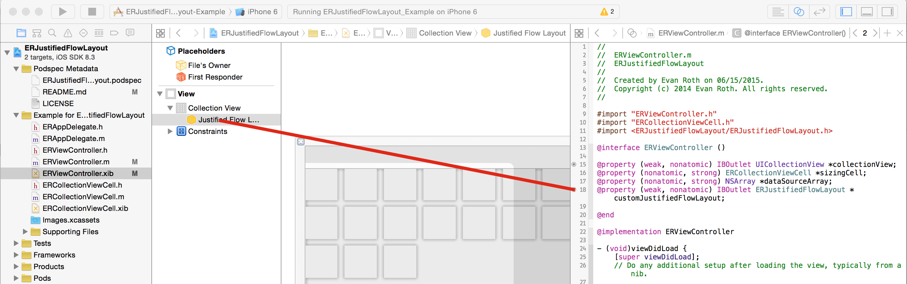
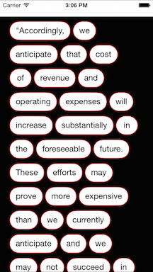
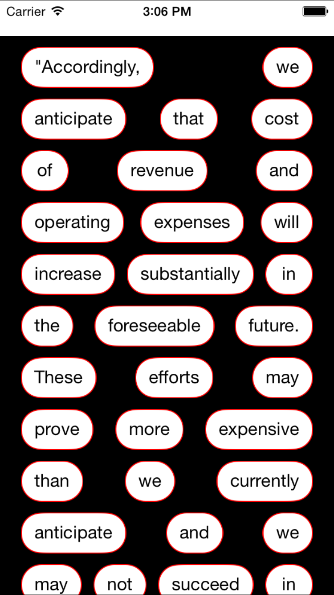
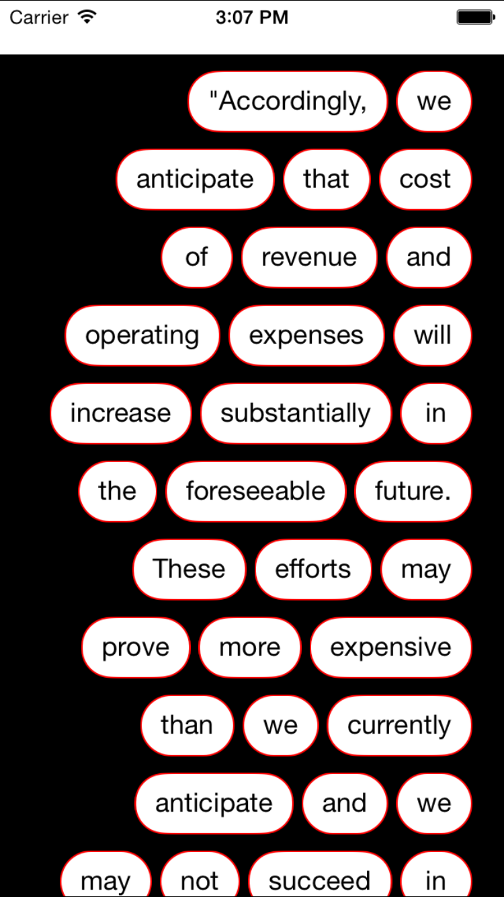

# ERJustifiedFlowLayout

[](https://travis-ci.org/Evan Roth/ERJustifiedFlowLayout)
[](http://cocoapods.org/pods/ERJustifiedFlowLayout)
[](http://cocoapods.org/pods/ERJustifiedFlowLayout)
[](http://cocoapods.org/pods/ERJustifiedFlowLayout)

## About
This is for an iOS project and can be used on any iPad or iPhone.  `ERJustifiedFlowLayout` is a subclass of Apple's `UICollectionViewFlowLayout` class, which is designed to be used in combination with a `UICollectionView`.  This project assumes you are familiar with the latter—if not, you can read about `UICollectionView` [here](https://developer.apple.com/library/ios/documentation/WindowsViews/Conceptual/CollectionViewPGforIOS/Introduction/Introduction.html#//apple_ref/doc/uid/TP40012334-CH1-SW1) and you can read about `UICollectionViewFlowLayout` [here](https://developer.apple.com/library/ios/documentation/WindowsViews/Conceptual/CollectionViewPGforIOS/UsingtheFlowLayout/UsingtheFlowLayout.html#//apple_ref/doc/uid/TP40012334-CH3-SW1).

`ERJustifiedFlowLayout` works with dynamic or static-sized `UICollectionViewCells`, as it only handles the layout aspect.

## Usage

To run the example project, clone the repo, and run `pod install` from the Example directory first.


## Requirements
Tested on iOS 7 and 8 on all iPads and iPhones from 4S to 6+.

## Installation

ERJustifiedFlowLayout is available through [CocoaPods](http://cocoapods.org). To install it, simply add the following line to your Podfile:

```ruby
pod "ERJustifiedFlowLayout"
```

## Instructions
ERJustifiedFlowLayout can be used programmatically in the `viewDidLoad` method of the view controller your collection view is in:

```ERJustifiedFlowLayout *flowLayout = [[ERJustifiedFlowLayout  alloc] init];```

or a reference to it can be created from your xib/storyboard like so:



Once instantiated or referenced, `ERJustifiedFlowLayout` requires only the setting of one property, with a few others as options:

* **Required**: `FlowLayoutHorizontalJustification`—an enum on `ERJustifiedFlowLayout` that sets the type of horizontal justification to perform:
	* `FlowLayoutHorizontalJustificationLeft`
	* `FlowLayoutHorizontalJustificationFull`
	* `FlowLayoutHorizontalJustificationRight`
* **Optional**
	* `horizontalCellPadding`: controls the amount of absolute space between each cell.  Default is `0`.  This property overrides the `minimumInteritemSpacing` property on `UICollectionViewFlowLayout`.
	* `sectionInset`: this `UICollectionViewFlowLayout` property can be set to provide left, right, top, and bottom section insets which are used in calculating cell justification.

## Screenshots

<p align="center">
  
  </br>This depicts the following settings:
  <br> FlowLayoutHorizontalJustificationLeft, left section inset = 20, horizontalCellPadding = 5
</p>

<p align="center">
  
  </br>This depicts the following settings:
  <br> FlowLayoutHorizontalJustificationFull, left/right section inset = 20, horizontalCellPadding = 5
</p>

<p align="center">
  
  </br>This depicts the following settings:
  <br> FlowLayoutHorizontalJustificationRight, right section inset = 20, horizontalCellPadding = 5
</p>

## Improvements
Ability to vertically align cells (top, middle, bottom) is coming soon, as is the ability to horizontally center justify cells.

## Author

Evan Roth, evanroth@me.com

## License

ERJustifiedFlowLayout is available under the MIT license. See the LICENSE file for more info.
